# 1. 怎么画原理图库

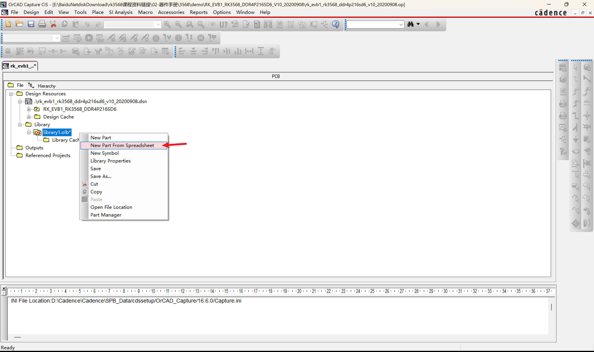

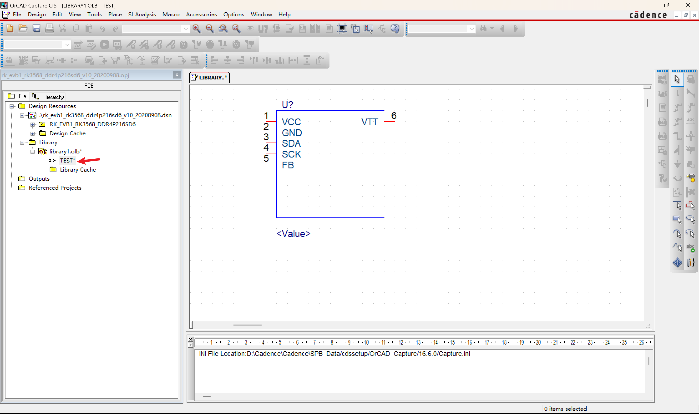

## 也可以是上一节从数据库中导入

# 2. 原理图和PCB文件导出到库文件

原厂提供的demo板，可以拷贝过来用。

## 2.1 原理图部分

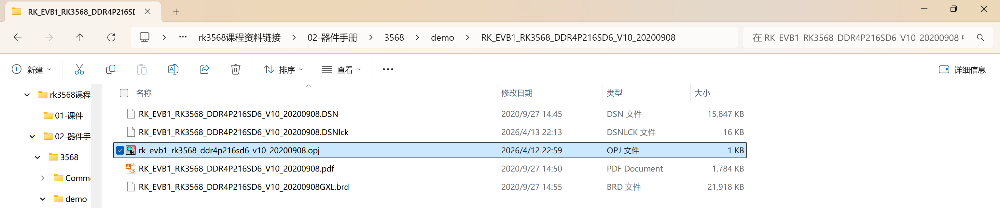

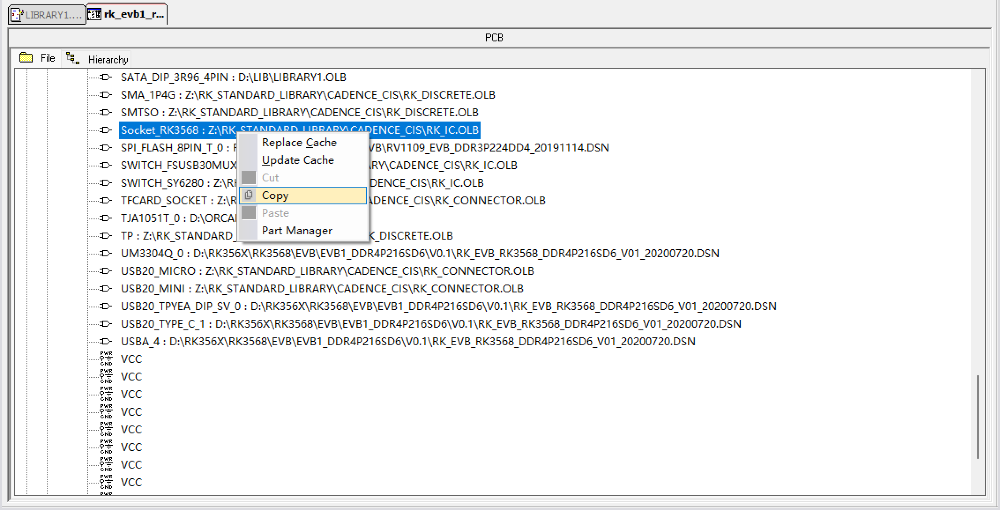

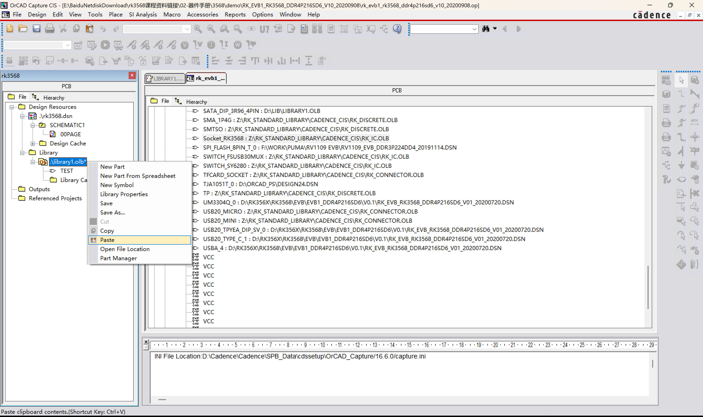

现在新建一个 design，然后怎么导入刚才的 library。

可以在这里导入我们之前新建的 library。

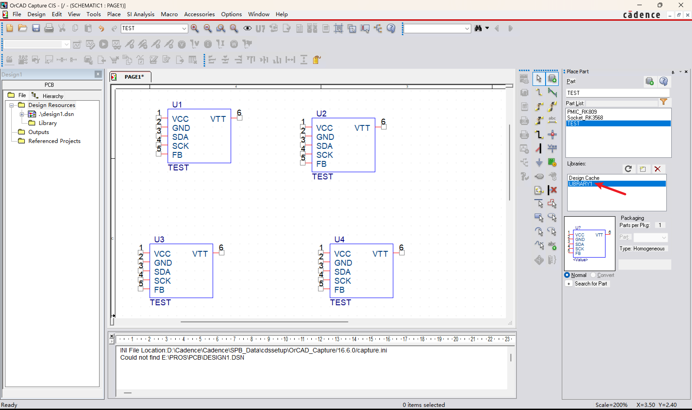

## 2.2 PCB部分
打开 PCB Editor。

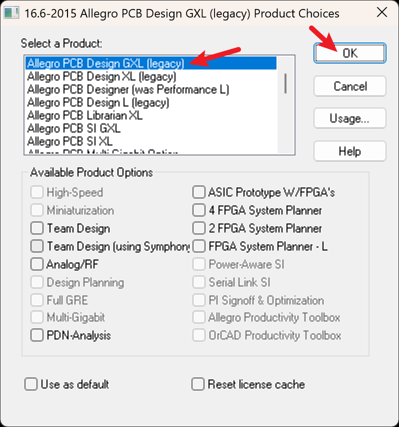

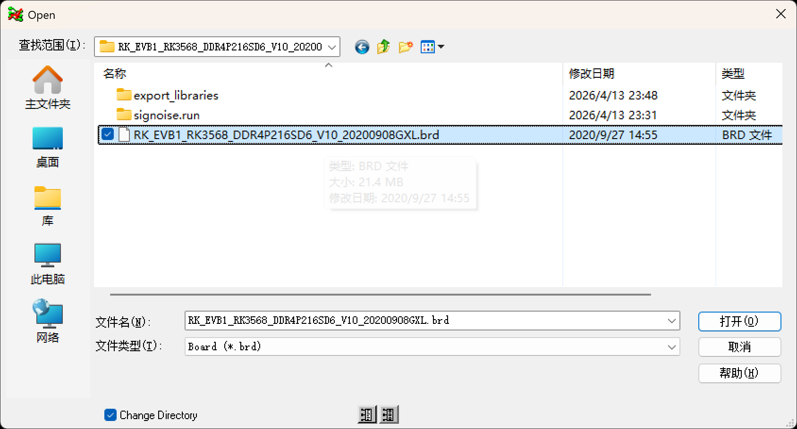

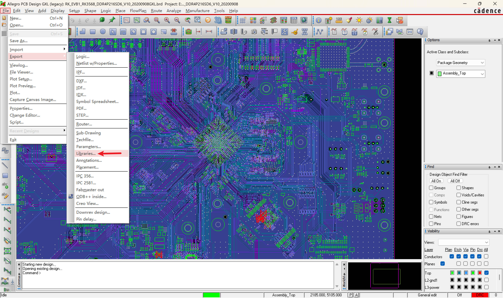

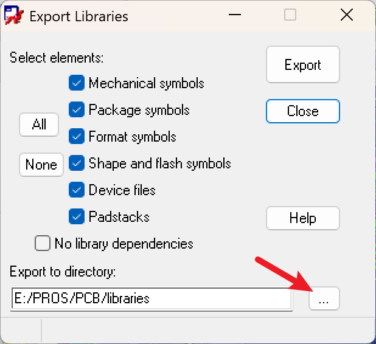
export之后，在保存的路径就可以找到。

可以打开 bga636_65rx65rx45r3_s.dra 看一下。

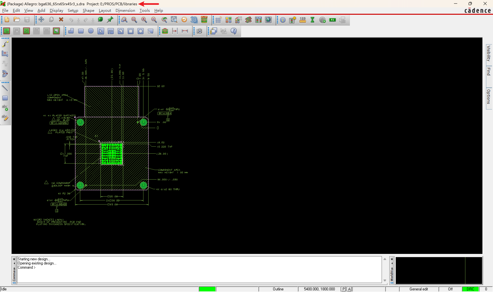

点击一下里面的内容，可以看到哪一层，比如：

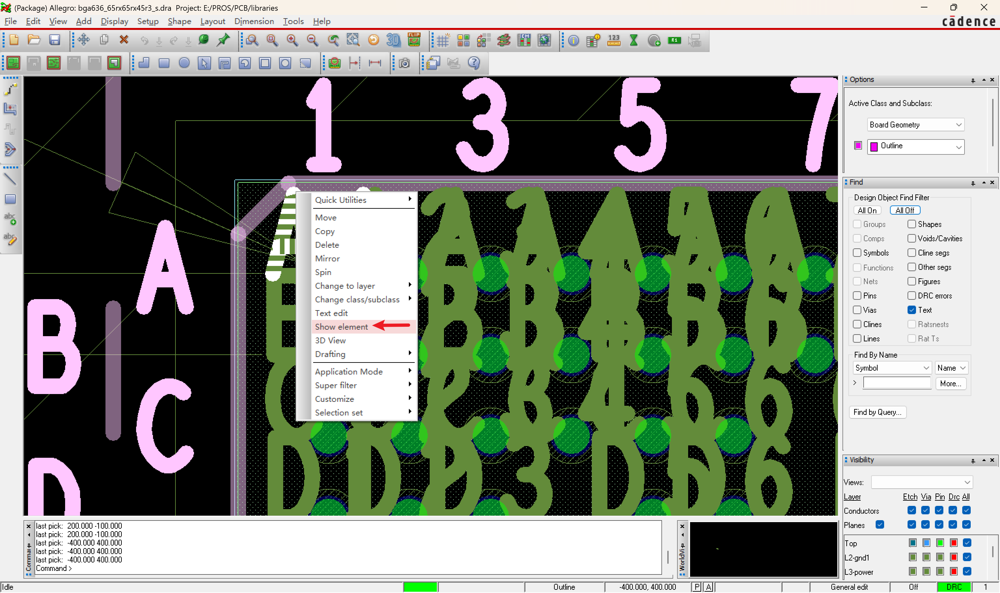

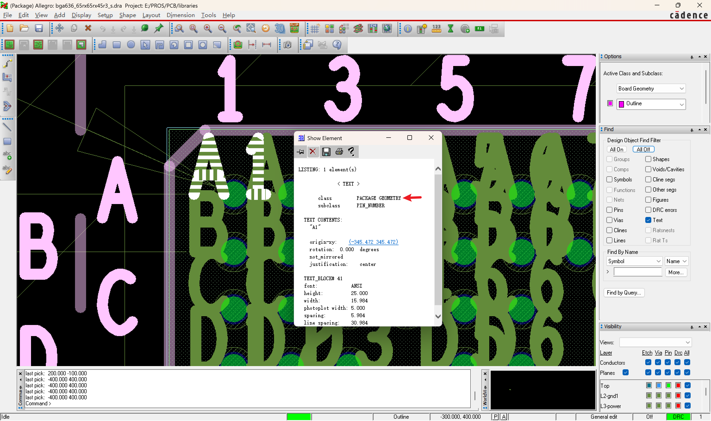

里面的 PIN_NUMBER显示的太不方便看，关掉，就可以根据上面的哪一层和PIN_NUMBER进行关闭。

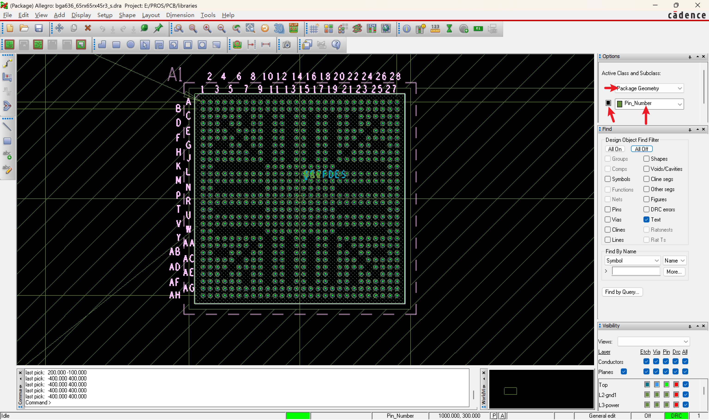

拷贝下面两个文件到我们前面设置的pcb库中。
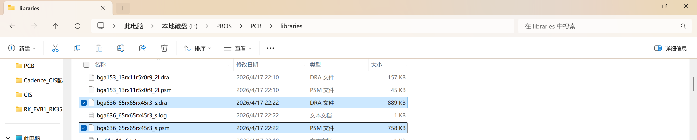

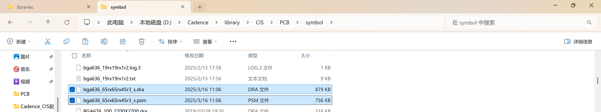

还需要拷贝pad文件。
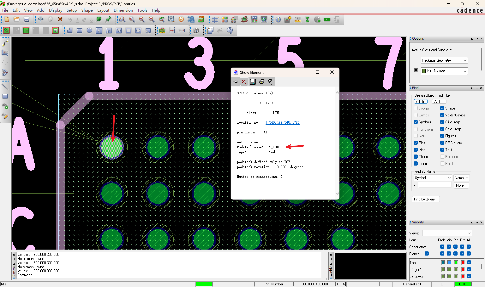

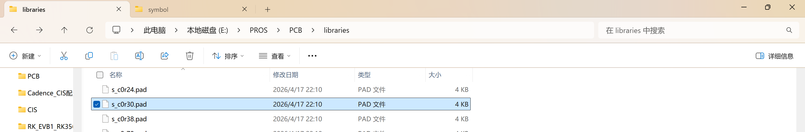

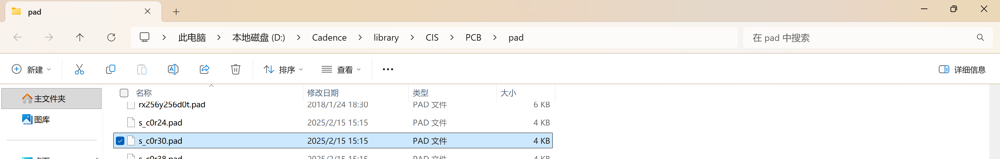

做好自己的原理图库和PCB库之后，可以将它们添加到数据库中进行管理，或者直接place part的形式直接调用。

