# 封面
RK3568_CB_1V0
Schematics Document
REV:1.0
Date

# 变更记录
Version Description & Update
Menter修改者
Date

# 框图
sys block
power sequence block
……

# 详情页

# Title

---

# 操作记录：
## 1. Cover
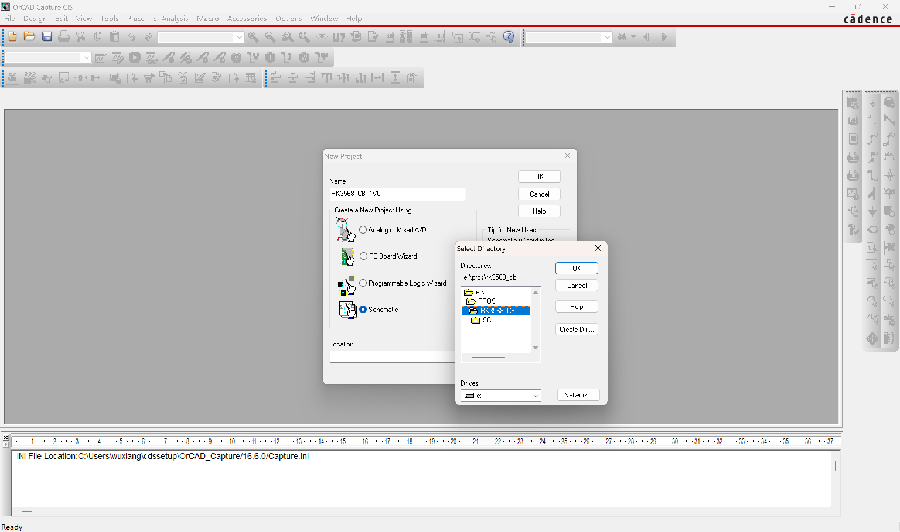

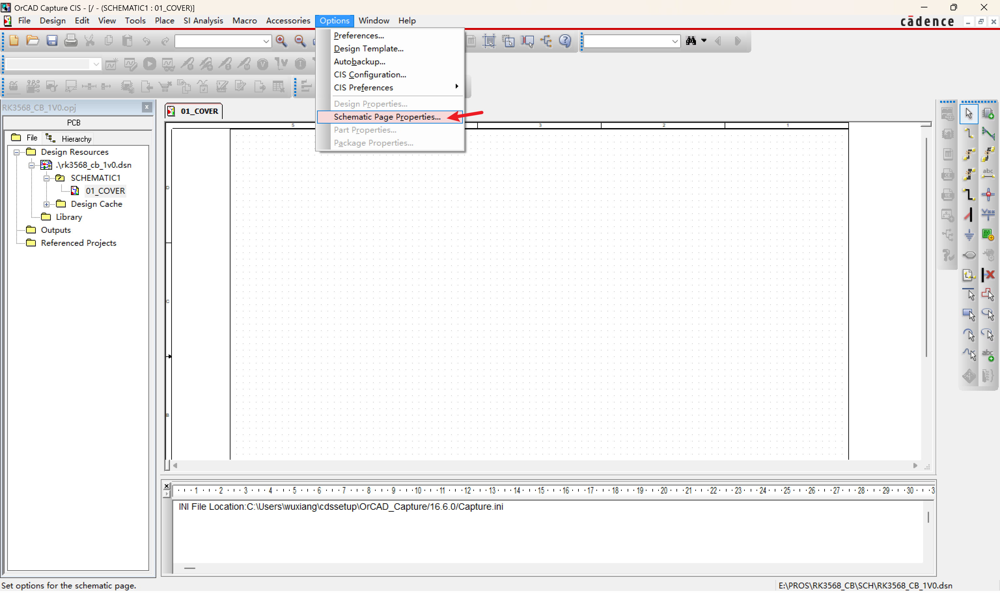

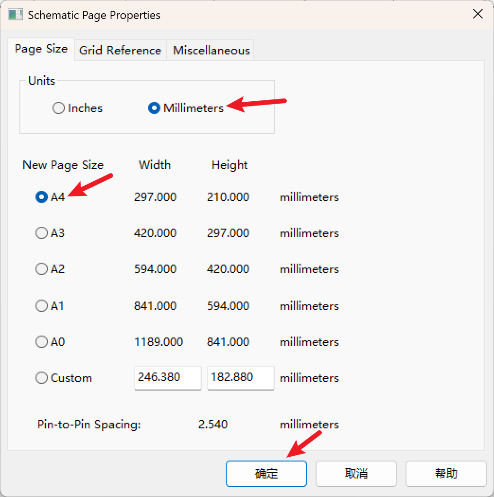

快捷键 “t”可以加文本。

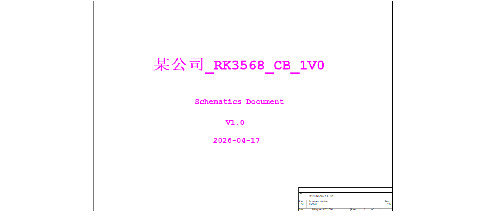

右下角默认的 title 不喜欢的话，可以删除后如下自行放置。

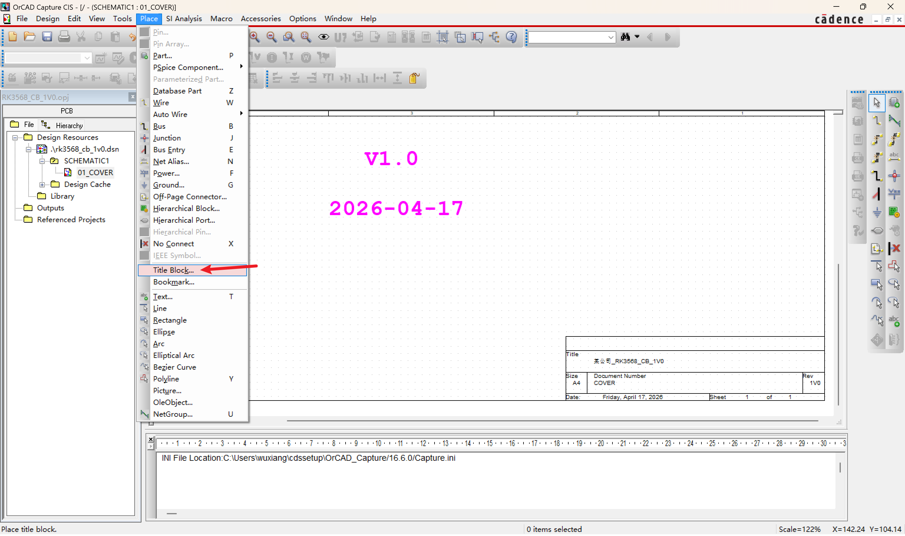

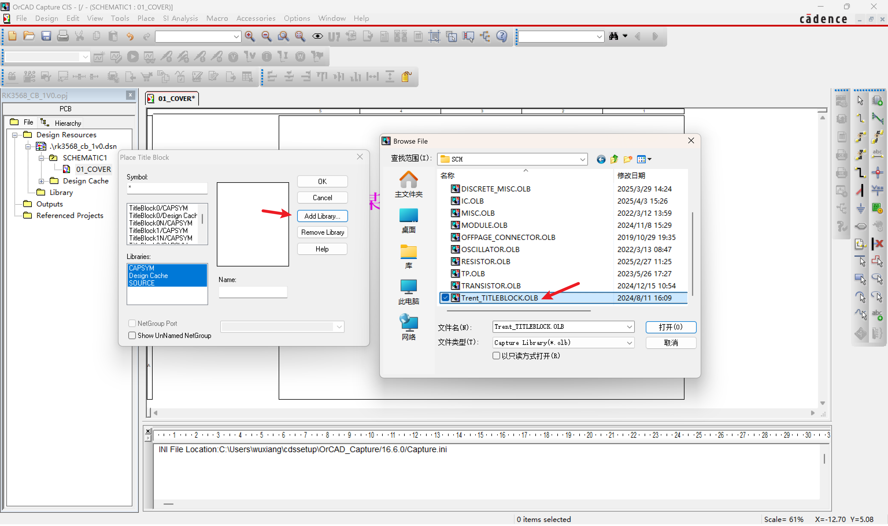

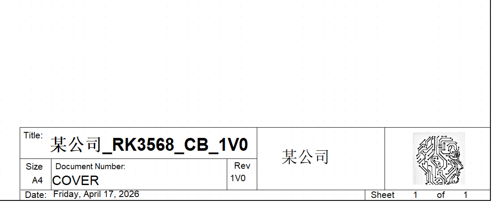

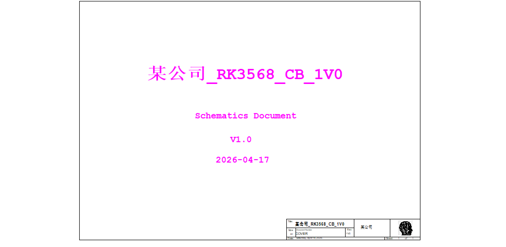

## 2. Version Description & Update

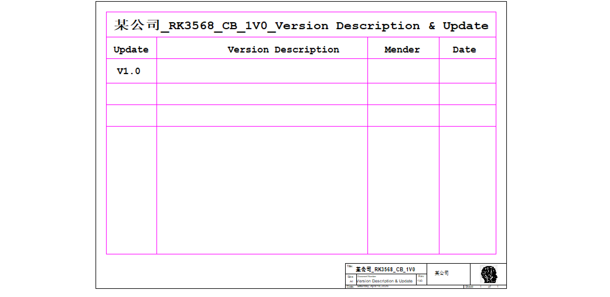

## 3. Sys_Block

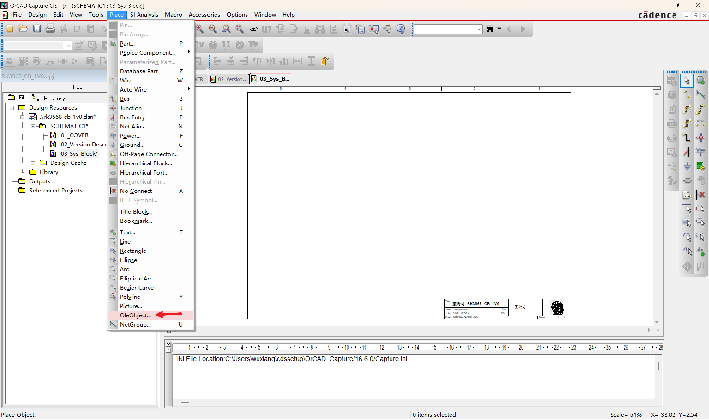

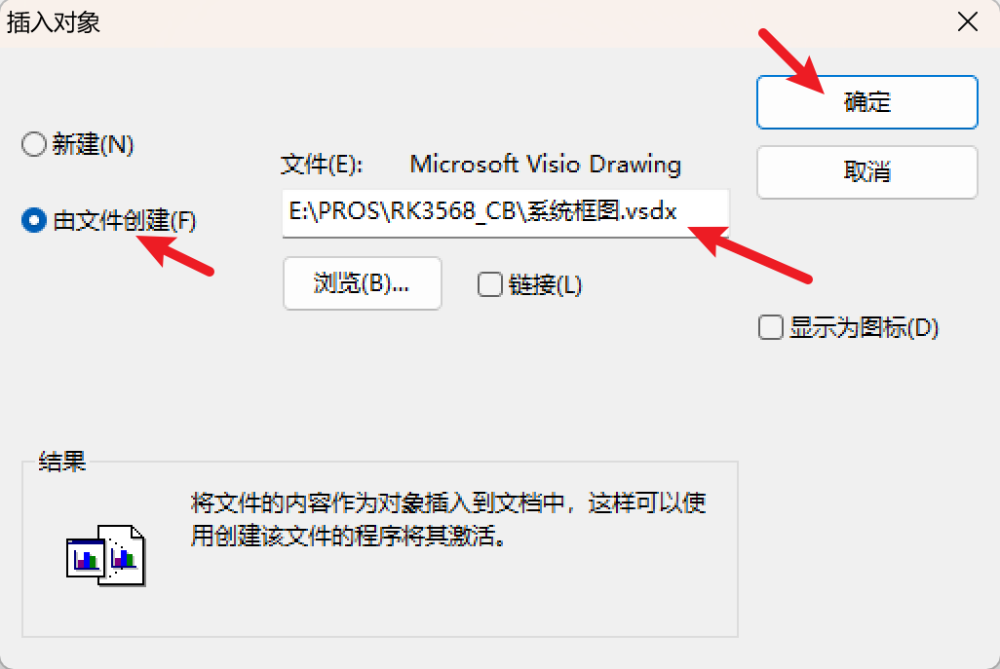

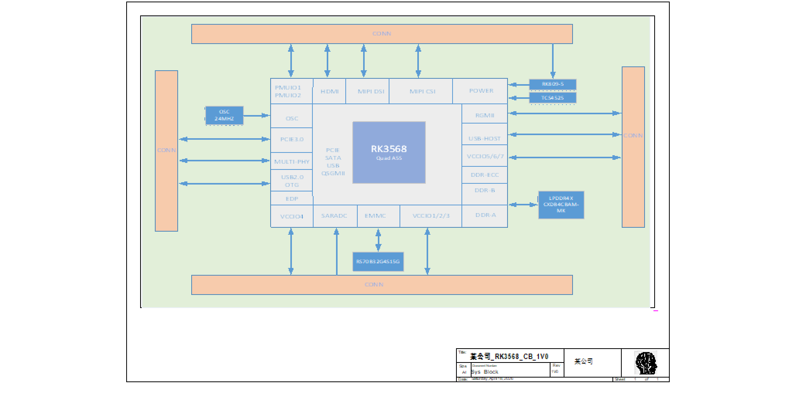

## 4. Power Sequence Block
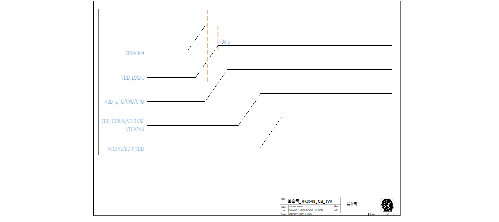

