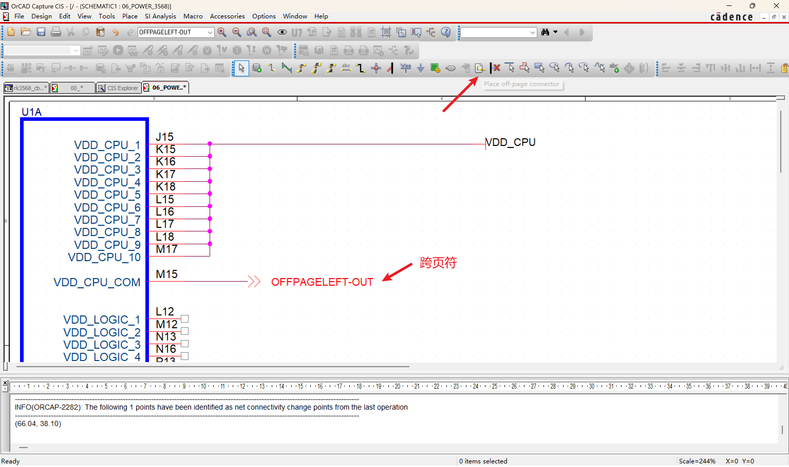
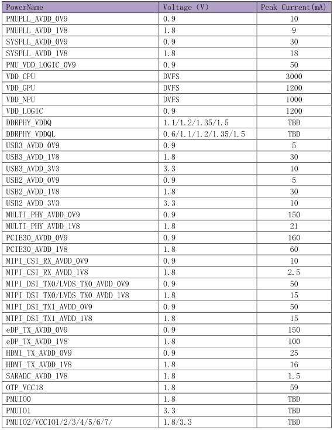
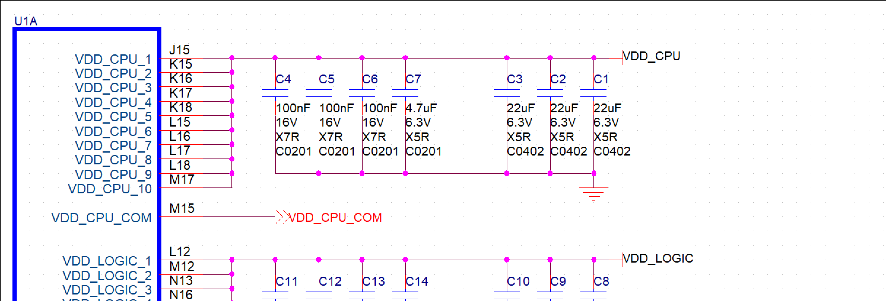
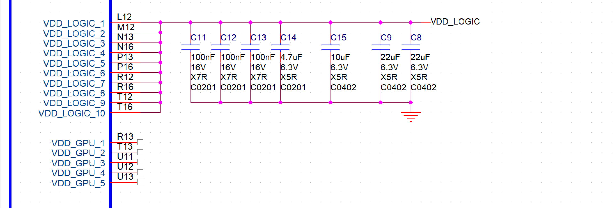
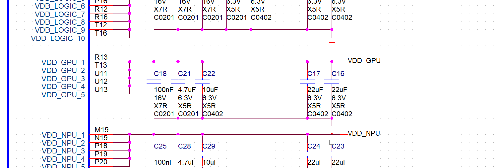
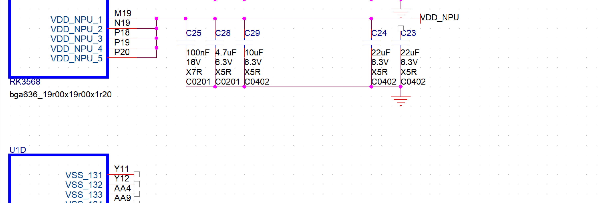

# 电源设计

## VDD_CPU -- DVFS 3000mA

> Dynamic Voltage and Frequency Scaling 动态电压频率调节。
通俗定义CPU负载低时自动降频、降压；负载高时自动升频、升压，实时匹配功耗，省电且性能够用。

先看 VDD_CPU，电流是 3A，靠近处理器的地方需要放一些退耦电容和储能电容。容量和电流是有关系的。

通常：1~3A的应用，10uF到47uF；3~5A的应用，47uF到100uF。

1. 退耦电容（去耦电容）
作用：紧贴 SoC 芯片 CPU 内核引脚，滤除ns~μs 级高频开关噪声、引脚瞬态电流尖峰，抵消引脚走线寄生电感，稳定芯片本地电源电压，解决内核晶体管开关瞬间的电压毛刺。

    特点：小容值、超近摆放、覆盖全高频段，离芯片引脚越近越好。

2. 储能电容
作用：承接电源 Buck 链路，应对ms 级大电流动态跳变、DVFS 调压瞬态跌落、满载 3A 峰值拉载，给整条电源轨做能量缓冲，补足电源来不及响应的大电流缺口，防止大负载下电源轨电压塌陷。

    特点：大容值、电源主干排布、低频大电流储能，严格匹配你给的电流容值规则。

---

1. **100nF**
高频滤波、引脚退耦，滤内核开关尖峰噪声，**容量小、响应快**。

2. **4.7μF（中频滤波电容）**
填补**100nF与22μF之间的频段空白**；
就近小储能，弥补DC-DC响应延迟，缓冲负载瞬态电压跌落；
**100nF无法替代，远端大电容也来不及补电**。

3. **22μF**
低频储能、大电流兜底，应对3A满载整体供电波动。

**小电容滤高频尖峰，中电容补中频瞬态，大电容做低频储能，容值梯队缺一不可。**

# VDD_LOGIC -- 0.9V 1200mA

# VDD_GPU -- DVFS 1200mA

# VDD_NPU -- DVFS 1000mA

