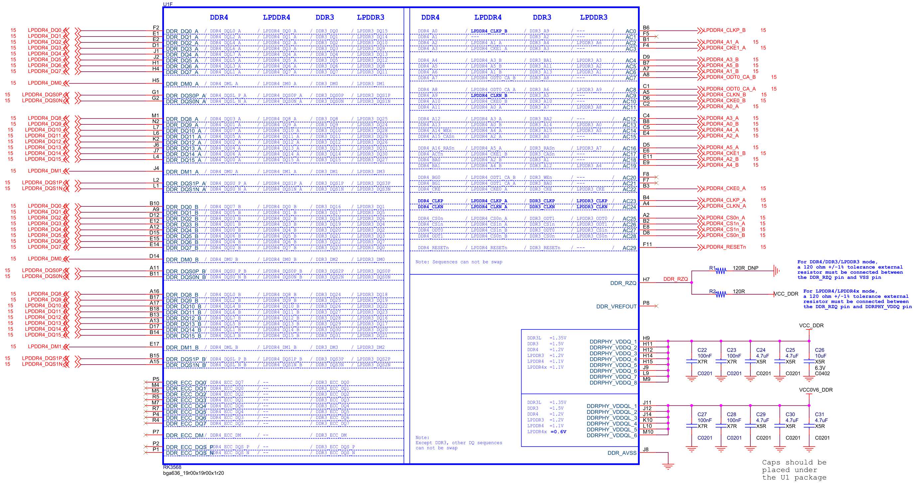

# DDR-PHY 设计

# 1. 选型
1Gx4

512Mx8

256Mx16

本质是在描述：
- 存储深度 × 数据位宽（organization）

| 表达        | 含义               | 总容量         |
| --------- | ---------------- | ----------- |
| 1G × 4    | 1G 个地址，每次读 4bit    | 4Gb（=512MB） |
| 512M × 8  | 512M 个地址，每次读 8bit  | 4Gb（=512MB） |
| 256M × 16 | 256M 个地址，每次读 16bit | 4Gb（=512MB） |

👉 结论：

三者容量完全一样（都是 4Gb），只是“位宽组织方式不同”


如果现在有个需求，假设 SoC DDR 总线是 32-bit，需求 16Gb 容量的内存，怎么选型？

1. 用 x4：32 / 4 = 8 颗粒并行
    - 1G x 4 的话，4 x 8 需要 8 片，总容量是 4Gb x 8 = 32Gb，足够
2. 用 x8：32 / 8 = 4 颗粒并行
    - 512M × 8 的话，8 x 4 需要 4 片，容量是 4Gb x 4 = 16Gb，刚好
3. 用 x16：32 / 16 = 2 颗粒并行
    - 256M x 16 的话，16 x 2 需要 2 片，容量是 4Gb x 2 = 8Gb，不够

---

## 关键影响：

| 类型  | 并行颗粒数 | 带宽利用 | 抗干扰 |
| --- | ----- | ---- | --- |
| x16 | 少     | 一般   | 一般  |
| x8  | 中     | ✅好   | ✅好  |
| x4  | 多     | 理论最好 | 最强  |


### 1️⃣ PCB复杂度

| 类型  | 复杂度       |
| --- | --------- |
| x16 | ✅最简单      |
| x8  | 中等        |
| x4  | ❌最复杂（颗粒多） |

### 2️⃣ 成本

| 类型  | 成本     |
| --- | ------ |
| x16 | 低（颗粒少） |
| x8  | 中      |
| x4  | 高（颗粒多） |

### 3️⃣ 稳定性 & 容错（ECC相关）

这个是很多人忽略的重点：

x4 结构更适合做 ECC（纠错）
因为数据分布更分散

| 类型  | 可靠性   |
| --- | ----- |
| x4  | ✅服务器级 |
| x8  | ✅车规常用 |
| x16 | 一般    |

# 2. tCK，CAS，Data Rate，带宽

## tCK（时钟周期）

tCK = 时钟周期时间（Clock Cycle Time）

```
tCK = 1 / 频率
```

举例:

DDR 3200（真实时钟 1600MHz）

tCK = 1 / 1600MHz ≈ 0.625ns

- 本质理解：
    - tCK 决定：
    - 一拍有多长时间
    - 所有 timing（CAS、tRCD、tRP）都是按“拍”计数

## CAS（CL，CAS Latency）

CAS Latency（CL）=
从发出读命令，到数据返回，需要多少个时钟周期

举例

CL = 16，tCK = 0.625ns

实际延迟：

CAS 延迟 = CL × tCK
         = 16 × 0.625ns
         = 10ns

CL 本身没意义，关键是：

```
真实延迟 = CL × tCK
```

## Data Rate（数据速率）

DDR = Double Data Rate，每个时钟周期传输两次数据

关系：
```
Data Rate = 2 × 时钟频率
```

| 标称        | 实际时钟 | Data Rate |
| ----------- | ------- | --------- |
| DDR4-3200   | 1600MHz | 3200 MT/s |
| LPDDR4-4266 | 2133MHz | 4266 MT/s |
| LPDDR5-6400 | 3200MHz | 6400 MT/s |

- 单位说明：
    - MHz → 时钟频率
    - MT/s → 每秒传输次数（不是Hz）

## 带宽

```
带宽 = Data Rate × 总线位宽 / 8
```

比如 32-bit DDR，DDR4-3200：

带宽 = 3200 × 32 / 8
    = 12.8 GB/s
（注意是大B）

## 高频 ≠ 低延迟

举例对比：

| 配置   | 频率      | CAS Latency (CL) | 时钟周期 tCK | 延迟 | 带宽      |
| ----  | --------- | ---------------- | -------- | ------- | --------- |
| 配置 1 | 3200 MT/s | 22              | 0.625ns  | 13.75ns | 12.8 GB/s |
| 配置 2 | 2400 MT/s | 14              | 0.833ns  | 11.66ns | 9.6 GB/s  |

- 带宽对比：
配置 1（3200 MT/s）带宽更高，适合需要大带宽的任务（UI 渲染、视频播放等）。
- 延迟对比：
配置 2（CL 14， 11.66ns）真实延迟更低，适合需要快速响应的任务（数据库查询、硬件控制等）。

### 总结：

高频决定带宽，低延迟决定响应速度。选择时要看任务特性：数据流量 vs 响应速度。


# 3. 原理图




